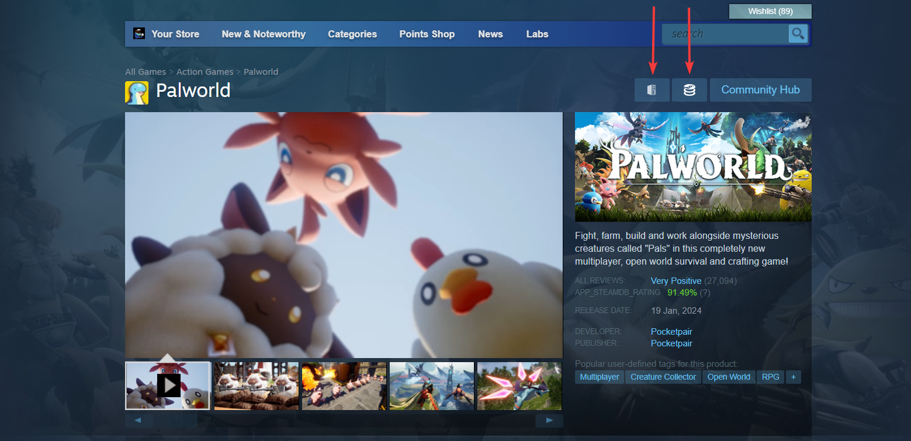

# Steam-SteamDB-addon
An addon for the steam client that integrates the SteamDB browser addon (https://github.com/SteamDatabase/BrowserExtension)

## Installation
1. Install SFP Patcher from [here](https://github.com/PhantomGamers/SFP/releases) for instruction go [here](https://github.com/PhantomGamers/SFP#instructions)
2. Enable "Inject javascript" in the SFP Patchers settings
3. Proceed into your skins folder.
4. Download this addon from [here](https://github.com/tddebart/Steam-SteamDB-addon/releases/latest/download/SteamDB-addon.zip)

### Creating a new skin
5. Create a new folder in you skins folder
6. Extract the zip into the new folder
7. Select the skin in SFP
8. Done, open a steam store page and you should now see two extra buttons at the top, if not then try to install again


### Add to existing skin
5. Open your skin folder
6. Extract only the SteamDB folder from the zip, without the root webkit.js and webkit.css
7. Add ```import "./SteamDB/webkit.js";``` to the top of your skin `webkit.js` file
8. Add ```@import "./SteamDB/webkit.css";``` to the top of your skin `webkit.css` file
9. Done, open a steam store page and you should now see two extra buttons at the top, if not then try to install again

